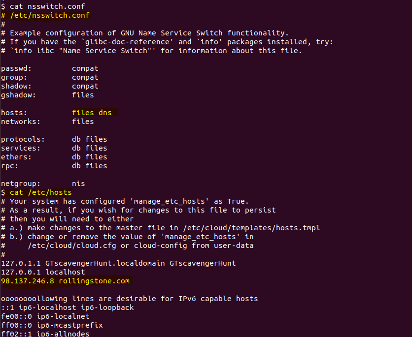
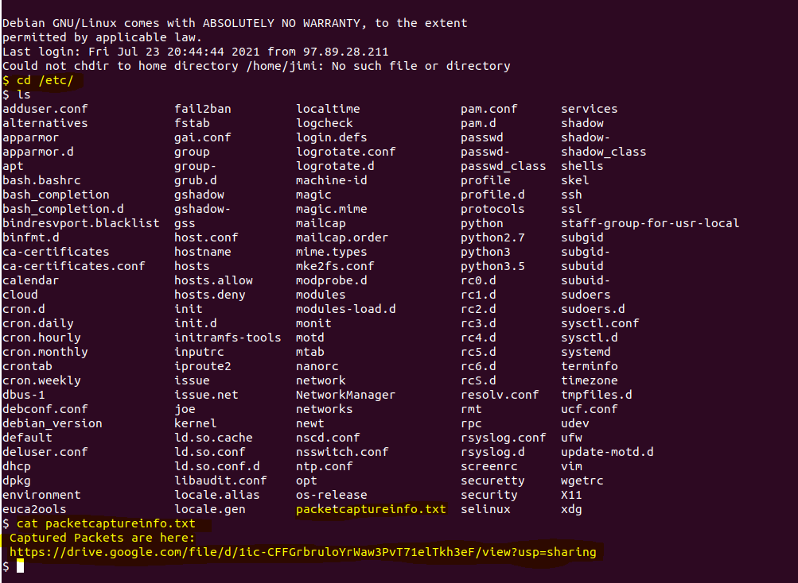
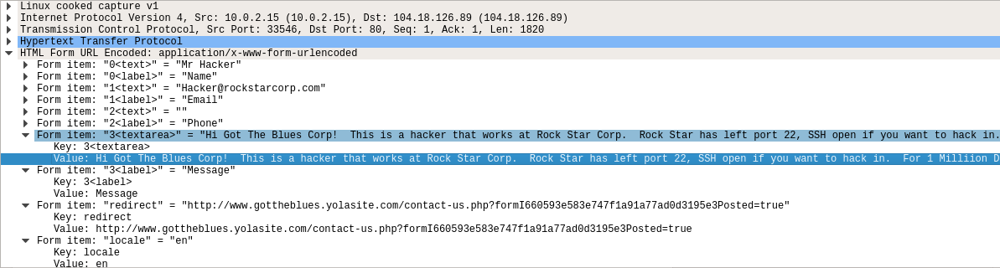

## Week 8: OSI Model, Ping, Nmap, SSH, Nslookup & Wireshark

### Phase 1

Determined IP ranges by visiting the following website: https://www.ipaddressguide.com/cidr
        * 15.199.95.91/28 = 15.199.95.80 - 15.199.95.95
        * 15.199.94.91/28 = 15.199.94.80 - 15.199.94.95
        * 11.199.158.91/28 = 11.199.158.80 - 11.199.158.95
        * 167.172.144.11/32 = 167.172.144.11- 167.172.144.11
        * 11.199.141.91/28 = 11.199.141.80 - 11.199.141.95

Ran fping against the IP ranges using the following commands:
        fping -g  15.199.95.80 15.199.95.95
        All are unreachable.
        fping -g 15.199.94.80 15.199.94.95
        All are unreachable.
        fping -g 11.199.158.80 11.199.158.95
        All are unreachable.
        fping -g 167.172.144.11 167.172.144.11
        167.172.144.11 is alive.
        fping -g 11.199.141.80 11.199.141.95
        All are unreachable.

Findings: All of RockStar Corp’s Hollywood IP addresses are unreachable EXCEPT 167.172.144.11.  This IP address poses a potential vulnerability to RockStar Corp. as it is responding and the company does not want their IP addresses to respond to any requests.

Recommendation: Determine which port is open, then close it.

OSI: Pings occur at the network layer.

### Phase 2

Ran the following command to run Nmap: sudo nmap -sS 167.172.144.11

Results:

        Starting Nmap 7.60 ( https://nmap.org ) at 2021-07-23 16:25 EDT
        Nmap scan report for 167.172.144.11
        Host is up (0.0011s latency).
        Not shown: 990 filtered ports
        PORT     STATE  SERVICE
        22/tcp   open   ssh
        80/tcp   closed http
        110/tcp  closed pop3
        111/tcp  closed rpcbind
        113/tcp  closed ident
        143/tcp  closed imap
        1025/tcp closed NFS-or-IIS
        1723/tcp closed pptp
        3306/tcp closed mysql
        8080/tcp closed http-proxy

        Nmap done: 1 IP address (1 host up) scanned in 28.19 seconds

Findings: Port 22 is open and is a potential vulnerability.

Recommendation: Close port 22 and disable ssh.

OSI: SYN scans run on the transport layer.

### Phase 3

Command to login to the server: ssh jimi@167.172.144.11 -p 22

Jimi is the username we were given, 167.172.144.11 is the responding IP address, port 22 is the open port, and port 22 is used to ssh.  Combining this information I was able to login to the server.

Rollingstone.com:  It looks like the /etc/nsswitch.conf file is set up to query the /etc/hosts file before checking the DNS for name service requests (Kili, 2017).  The /etc/hosts file lists rollingstone.com with the following ip address before the web address: 98.137.246.8.  This configuration is redirecting the traffic intended to go to rollingstone.com to 98.137.246.8 which is not the IP address for Rolling Stone.

Nslookup Command: nslookup rollingstone.com
 Results:
        Server:		8.8.8.8
        Address:	8.8.8.8#53

        Non-authoritative answer:
        Name:	rollingstone.com
        Address: 151.101.0.69
        Name:	rollingstone.com
        Address: 151.101.128.69
        Name:	rollingstone.com
        Address: 151.101.192.69
        Name:	rollingstone.com
        Address: 151.101.64.69

My results in Linux did not come up with “unknown” as mentioned in the homework instructions so I ran the same command in Git Bash on my local and came up with “unknown”.  Here are the results Git Bash gave me:
  		  Server:  UnKnown
        Address:  2600:6c5a:417f:3f45:26f5:a2ff:fe04:1c06

        Non-authoritative answer:
        Name:    rollingstone.com
        Addresses:  151.101.64.69
                    151.101.0.69
                    151.101.128.69
                    151.101.192.69
Findings: After pinging the IP addresses for the Hollywood office and then running the alive IP address with nmap I was able to ssh into a Rockstar Corp. server because the company repeatedly uses the same usernames and passwords.  If I was able to do this, it is only a matter of time before a hacker takes advantage of the same vulnerabilities: alive IP address, open port, weak username/passwords.

I also found the /etc/hosts file is configured with the incorrect IP address for rollingstone.com and is likely the cause for the employees’ inability to access the website.  The correct IP addresses for Rolling Stone are: 151.101.0.69, 151.101.128.69, 151.101.192.69, and 151.101.64.69.

Upon running nslookup on the incorrect IP address (98.137.246.8) in the /etc/host file I received the following results:

        8.246.137.98.in-addr.arpa	name = unknown.yahoo.com.

        Authoritative answers can be found from:

It seems a hacker may have been redirecting employee traffic to a malicious site rather than rollingstone.com.  They were likely attempting to collect employee usernames and passwords.

Recommendation: Rockstar Corp. should immediately update the usernames and passwords of all servers to unique, challenging usernames/passwords.  While at it, a strong password policy should be implemented for employees. As far as the Rolling Stone website, the rollingstone.com entry ought to be removed from the /etc/hosts file so employees will be able to access the correct website.

OSI: The ssh session occurred at the application layer.  The nslookup also occurred at the application layer as it uses DNS.  Looking at the IP addresses in the /etc/hosts file is the network layer.

### Phase 4

Locating Packet Captures

Findings:  An employee at Rock Star Corp. with the IP address 192.168.47.200 and MAC addresses 00:0c:29:0f:71:a3 and 00:0c:29:1d:b3:b1 is the hacker.  They left port 22 open so someone at Got the Blues Corp. could SSH in.  This employee offered to give up the username and password to the server for 1 million dollars.

The same IP address with 2 different MAC addresses indicates the hacker may be engaging in a man in the middle attack or the hacker changed his MAC address using the macchanger command.

OSI Layers Seen in Wireshark: The message was found in layer 7, the application layer. It looks like the hacker used an application to encode the message - encryption occurs on layer 6, the presentation layer. Beginning a conversation, as the hacker did, begins on layer 5, the session layer.  Ports are on layer 4, the transport layer, as the hacker referenced which port was left open. The IP address referenced was found on Layer 3, the network layer.  The MAC addresses referenced were found on layer 2, the data link layer.
Although not referenced in the findings, we also saw layer 1, the physical layer in Wireshark when looking at the frames and seeing the number of bytes on the wire.

### Bibliography
Kili, A. (2017, July 25). How to Setup Local DNS Using /etc/hosts File in Linux. TecMint. tecmint.com/setup-local-dns-using-etc-hosts-file-in-linux/
