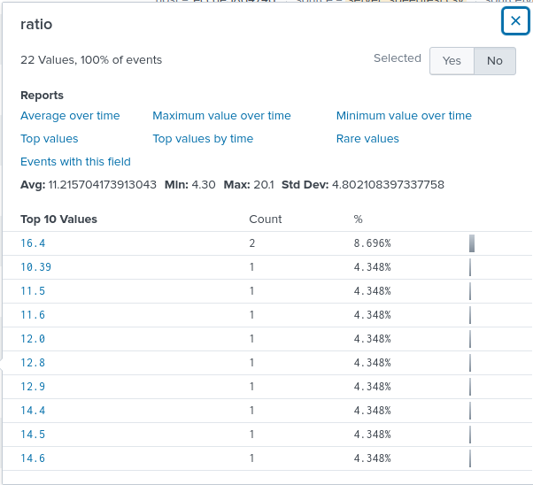
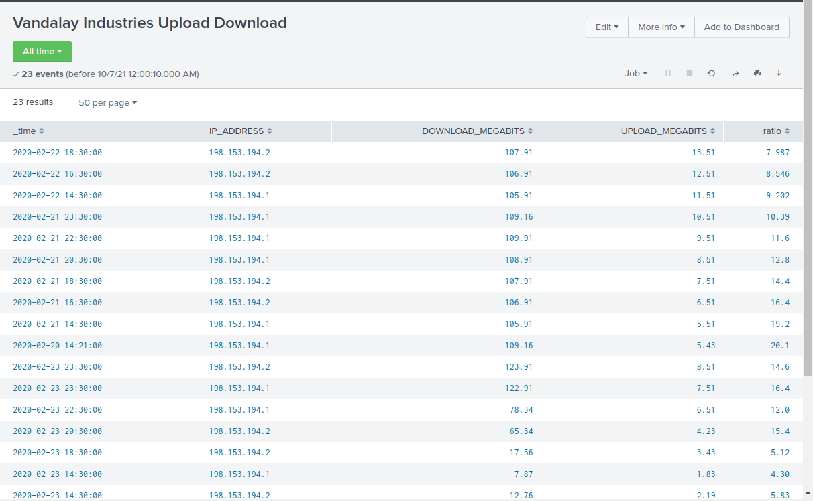
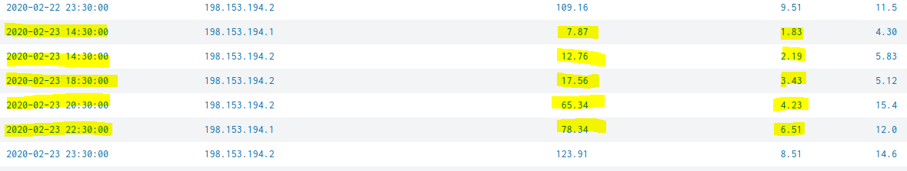
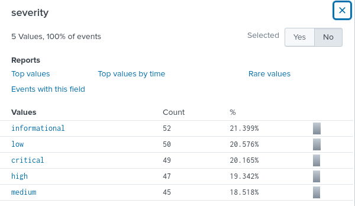
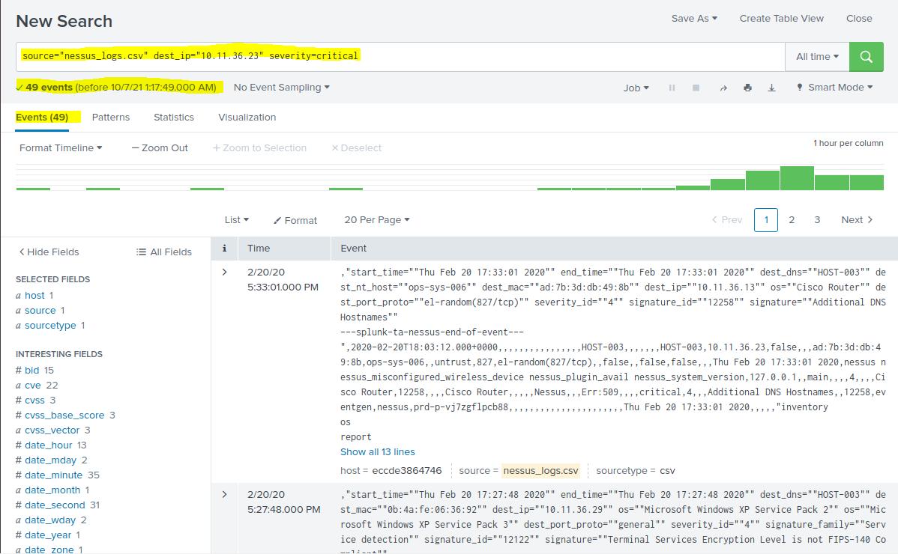
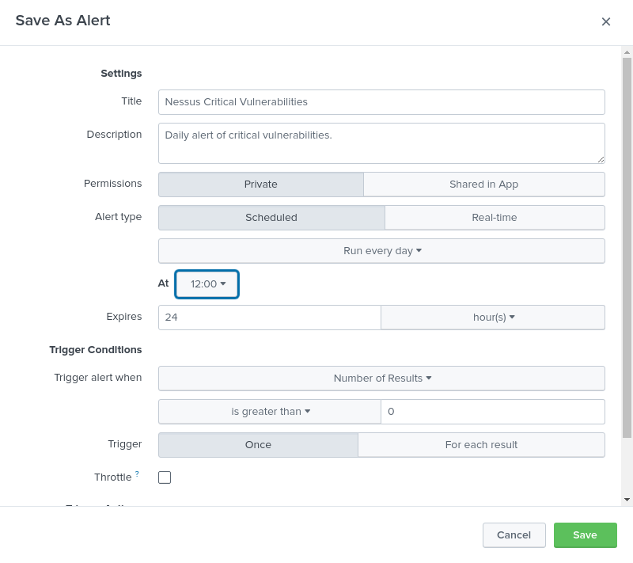
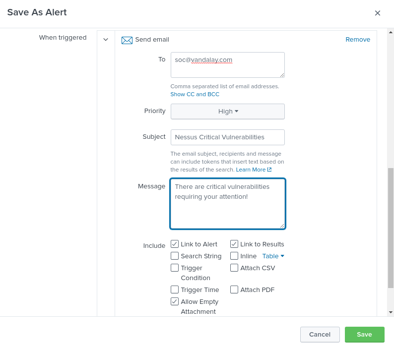
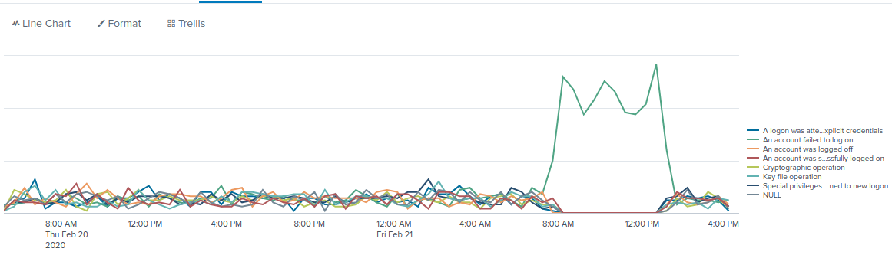
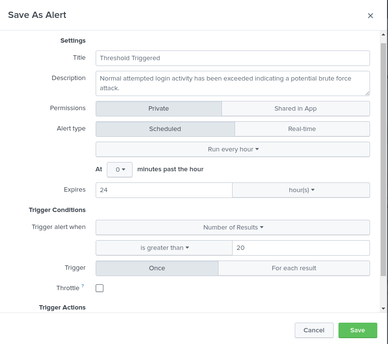
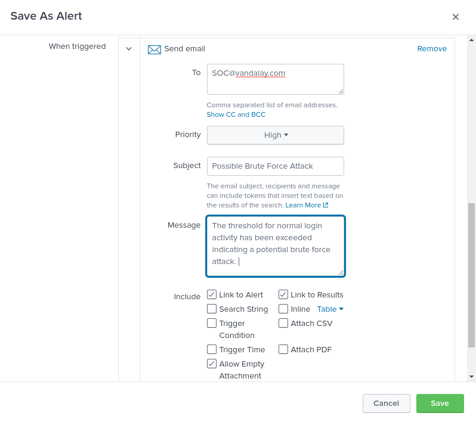

## Week 18: Splunk

### Part 1

**Task:** Using the eval command, create a field called ratio that shows the ratio between the upload and download speeds.

**Solution:** source="server_speedtest.csv"  | eval ratio=DOWNLOAD_MEGABITS/UPLOAD_MEGABITS

**Task:** Create a report using the Splunk's table command to display the following fields in a statistics report.

**Solution:** source="server_speedtest.csv" | eval ratio=DOWNLOAD_MEGABITS/UPLOAD_MEGABITS | table _time IP_ADDRESS DOWNLOAD_MEGABITS UPLOAD_MEGABITS ratio

Based on the report, the attack began on 2/23/2020, at approximately 2:30 pm.  The company experienced a significant reduction to upload and download speeds at this time

Upload and download speeds returned to their normal speed at about 11:30 pm on 2/23/2020.  Therefore, it took approximately 9 hours to recover. Highlighted are the times when upload/download speeds were below normal.

### Part 2

**Task:** Create a report that shows the count of critical vulnerabilities from the customer database server.

**Solution:** source="nessus_logs.csv" dest_ip="10.11.36.23" severity=critical

**Task:** Build an alert that monitors every day to see if this server has any critical vulnerabilities. If a vulnerability exists, have an alert emailed to soc@vandalay.com.

### Part 3

**Task:** Analyze administrator logs that document a brute force attack. Then, create a baseline of the ordinary amount of administrator bad logins and determine a threshold to indicate if a brute force attack is occurring.

**Solution:** source="Administrator_logs.csv"| timechart count by name

The brute force attack occurred on 2/21/20 and lasted from 8 am to 2:30 pm.

The average of logins appears to be around 8. However a baseline for normal activity is under 17. Therefore, a threshold of 20 is likely appropriate.

**Task:** Design an alert to check the threshold every hour and email the SOC team at SOC@vandalay.com if triggered.

